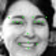

# Facial Filter
using OpenCV and CNN (convolutional neural network)

To see project blog: [https://adrianyi.com/2017/07/FacialFeatures.html](https://adrianyi.com/2017/07/FacialFeatures.html)

## Usage
This is still going through implementation.
Currently, you can run the following:  
```
python FacialFilter.py
```
This will use the pre-trained model to add sunglasses to all faces in an image ([example](#facial-filter-example) shown below).  
Currently, this part uses Keras.  I'll change it later to be purely in TensorFlow.

```
python train.py
```  
This will call the TensorFlow meta graph and load pre-trained weights.  It'll Iterate through 10 epochs with training data from Kaggle (you have to [download](https://www.kaggle.com/c/facial-keypoints-detection/data) it).  
The code can handle re-initializing weights instead, but I have not implemented an argument parser.  
See [example](#train-example) below.

Requirements:  
Download datasets from [https://www.kaggle.com/c/facial-keypoints-detection/data](https://www.kaggle.com/c/facial-keypoints-detection/data) and store the unzipped CSV files in data folder.
- Python 3.x
- OpenCV 3
- tensorflow 1.2.1
- pandas

### Facial Filter Example
Input:  


Output:  


### Train example
This outputs something like this
```
Loading data...
Data loaded. Training...
Epoch: 1    - Loss: 0.00461 , Accuracy: 0.952
              Valid Loss: 0.0044  , Valid Accuracy: 0.952
Epoch: 2    - Loss: 0.00444 , Accuracy: 0.951
              Valid Loss: 0.00433 , Valid Accuracy: 0.952
Epoch: 3    - Loss: 0.00462 , Accuracy: 0.95
              Valid Loss: 0.00437 , Valid Accuracy: 0.952
Epoch: 4    - Loss: 0.00443 , Accuracy: 0.952
              Valid Loss: 0.00432 , Valid Accuracy: 0.952
Epoch: 5    - Loss: 0.00426 , Accuracy: 0.953
              Valid Loss: 0.00433 , Valid Accuracy: 0.952
Epoch: 6    - Loss: 0.00459 , Accuracy: 0.951
              Valid Loss: 0.00432 , Valid Accuracy: 0.952
Epoch: 7    - Loss: 0.00429 , Accuracy: 0.953
              Valid Loss: 0.00433 , Valid Accuracy: 0.952
Epoch: 8    - Loss: 0.00431 , Accuracy: 0.952
              Valid Loss: 0.00432 , Valid Accuracy: 0.952
Epoch: 9    - Loss: 0.00468 , Accuracy: 0.952
              Valid Loss: 0.00432 , Valid Accuracy: 0.952
Epoch: 10   - Loss: 0.00416 , Accuracy: 0.953
              Valid Loss: 0.00432 , Valid Accuracy: 0.952
Finished training. Testing it on an image.
Test image saved as test_facial_feature.jpg
```  
where the test_facial_feature.jpg looks like this:  
  
Not bad! :)
