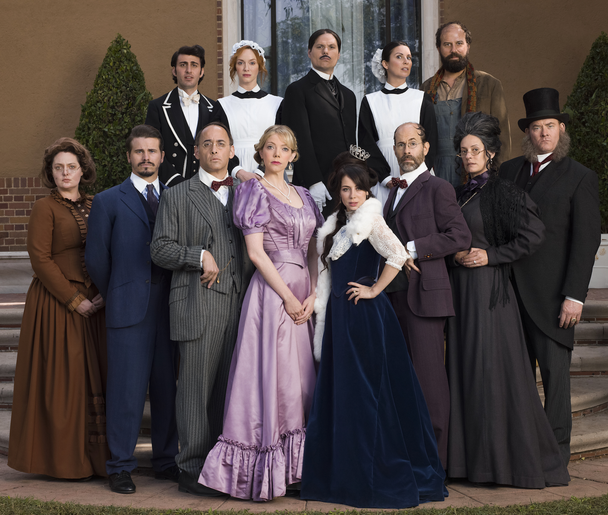
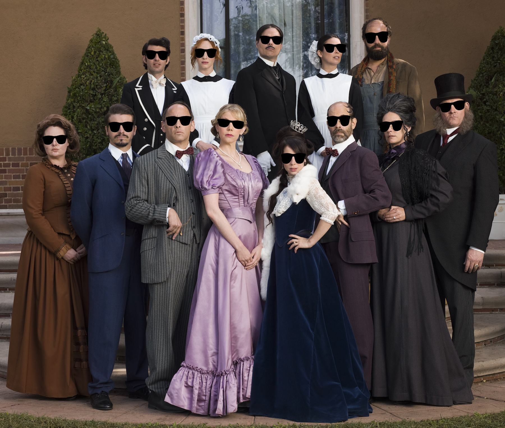

# Facial Filter
using OpenCV and CNN (convolutional neural network)

To see project blog: [https://adrianyi.com/2017/07/FacialFeatures.html](https://adrianyi.com/2017/07/FacialFeatures.html)

## Usage
This is still going through implementation.
Currently, you can run the following.  
```
python FacialFilter.py
```

Input:  


Output:  

